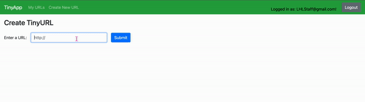

# TinyApp Project

TinyApp is a full stack web application built with Node and Express that allows users to shorten long URLs (à la bit.ly).

## Final Product

Final app screenshot:

## Getting Started

1. Install all dependencies (using the `npm install` command).
2. Run the development web server using the `node express_server.js` command.
3. Navigate to `localhost:8080` in your browser.

## Dependencies

- Node.js
- Express
- EJS
- bcryptjs
- body-parser
- cookie-session

## Features

- User Registration: New users can be created. Passwords are encrypted and stored securely using bcrypt.
- User Login: Users can login with email and password. Login sessions are maintained using encrypted cookies.
- URL Shortening: Users can create short URLs, which redirect to a longer URL of their choosing.
- URL Database: Short URLs are associated with the user who created them, and can only be edited or deleted by that user.
- User-specific Views: The URL index page (/urls) and the URL show page (/urls/:id) display relevant information specific to the logged-in user.
- Secure Logout: Users can log out of the application, which clears their login session.

## Project Specification

- Site Header: If a user is logged in, the header shows the user's email and a logout button. If a user is not logged in, the header shows a link to the login page (/login) and a link to the registration page (/register).
- GET /: If a user is logged in, redirect to /urls. If a user is not logged in, redirect to /login.
- GET /urls: If a user is logged in, returns HTML with the site header, a list (or table) of URLs the user has created, each list item containing a short URL, the short URL's matching long URL, an edit button which makes a GET request to /urls/:id, a delete button which makes a POST request to /urls/:id/delete, and a link to "Create a New Short Link" which makes a GET request to /urls/new. If a user is not logged in, returns HTML with a relevant error message.
- GET /urls/new: If a user is logged in, returns HTML with a form which contains a text input field for the original (long) URL, a submit button which makes a POST request to /urls. If a user is not logged in, redirects to the /login page.
- GET /urls/:id: If a user is logged in and owns the URL for the given ID, returns HTML with the short URL (for the given ID), a form which contains the corresponding long URL, an update button which makes a POST request to /urls/:id. If a URL for the given ID does not exist, returns HTML with a relevant error message. If a user is not logged in, returns HTML with a relevant error message. If a user is logged in but does not own the URL with the given ID, returns HTML with a relevant error message.
- GET /u/:id: If URL for the given ID exists, redirects to the corresponding long URL. If URL for the given ID does not exist, returns HTML with a relevant error message.
- POST /urls: If a user is logged in, generates a short URL, saves it, and associates it with the user, then redirects to /urls/:id. If a user is not logged in, returns HTML with a relevant error message.
- POST /urls/:id: If a user is logged in and owns the URL for the given ID, updates the URL and redirects to /urls. If a user is not logged in, returns HTML with a relevant error message. If a user is logged in but does not own the URL with the given ID, returns HTML with a relevant error message.
- POST /urls/:id/delete: If a user is logged in and owns the URL for the given ID, deletes the URL and redirects to /urls. If a user is not logged in, returns HTML with a relevant error message. If a user is logged in but does not own the URL with the given ID, returns HTML with a relevant error message.
- GET /login: If a user is logged in, redirects to /urls. If a user is not logged in, returns HTML with a form which contains input fields for email and password, submit button that makes a POST request to /login.
- GET /register: If a user is logged in, redirects to /urls. If a user is not logged in, returns HTML with a form which contains input fields for email and password, a register button that makes a POST request to /register.
- POST /login: If email and password params match an existing user, sets a cookie and redirects to /urls. If email and password params don't match an existing user, returns HTML with a relevant error message.
- POST /register: If email or password are empty, returns HTML with a relevant error message. If email already exists, returns HTML with a relevant error message. Otherwise, creates a new user, encrypts the new user's password with bcrypt, sets a cookie, and redirects to /urls.
- POST /logout: Deletes cookie and redirects to /login.

## Acknowledgment

The TinyApp project was built as part of the Web Development Bootcamp curriculum provided by Lighthouse Labs.

